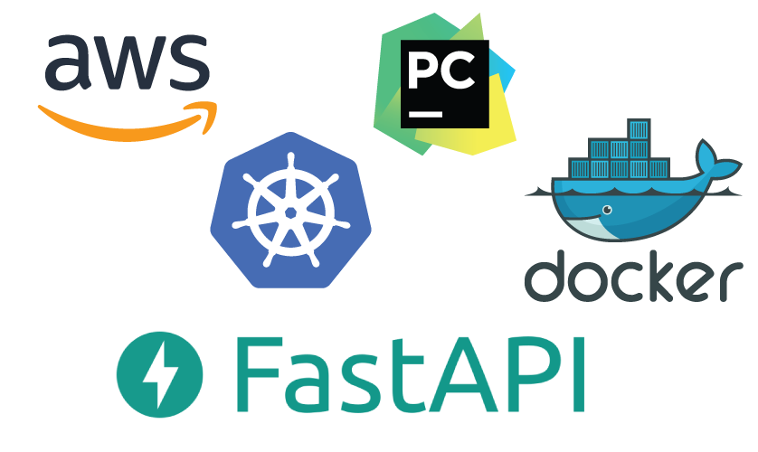

# FastAPI with Kubernetes




Welcome to the FastAPI & Kubernetes Tutorial Series with PyCharm & AWS EKS.

## Prerequisites 

Before starting up this project, make sure you have an AWS account and 
PyCharm installed in your machine.

* In this tutorial we will be using [PyCharm Professional](https://www.jetbrains.com/pycharm/).


### Software Installation

- [x] [AWS Command Line Interface](https://aws.amazon.com/cli/) - The AWS Command Line Interface (CLI) is a unified tool to manage your AWS services.


- [x] [eksctl](https://eksctl.io/) - The official CLI for Amazon EKS


- [x] [Docker](https://www.docker.com/) - Docker helps developers bring their ideas to life by conquering the complexity of app development.


- [x] [Kubernetes](https://kubernetes.io/) - also known as K8s, is an 
 open-source system for automating deployment, scaling, and management of containerized applications.


- [x] [PostgreSQL](https://www.postgresql.org/) - The World's Most Advanced Open Source Relational Database


- [x] [Redis](https://redis.io/) - open source (BSD licensed), in-memory data structure store, used as a database, cache, and message broker


- [x] [NICE DCV](https://www.nice-dcv.com/) (Optional) - Deliver high-performance remote desktop and application streaming. If 
you are interested to run your workload directly in AWS.


## Python Dependencies

- Installing Python Packages

```bash

$ pip install -r requirements.txt

```


- Running Uvicorn Server

```bash

$ uvicorn main:app --reload

```

## Testing

Before proceeding make sure you have created a test database in Postgres.


## References

If you are interested to know more about AWS with Python, then you can follow the below links.

- [Developing Serverless APIs using AWS Toolkit](https://www.jetbrains.com/pycharm/guide/tutorials/intro-aws/)
- [Developing Django Application using AWS](https://www.jetbrains.com/pycharm/guide/tutorials/django-aws/) 
